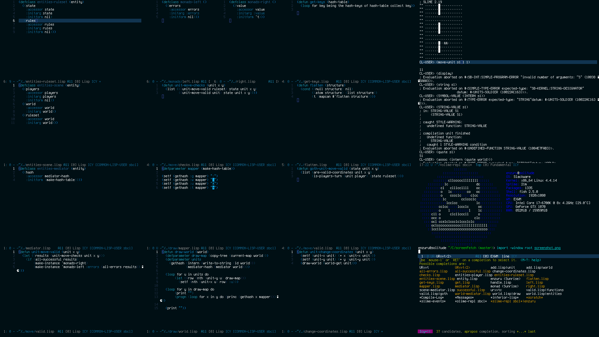

# enzu.ru .emacs.d

This handcrafted repo contains my Emacs Lisp code tying together a selection of around two hundred of the finest packages ever written for Emacs, all working in harmony with one another.

Around thirty languages and file formats are supported, but the three great Lisps (Common Lisp, Scheme, Clojure) are particularly well-supported, and ship with the REPL-centered IDEs [Sly](https://github.com/joaotavora/sly), [Geiser](https://www.nongnu.org/geiser/), and [Cider](https://github.com/clojure-emacs/cider) respectively.

When I was starting off with GNU Emacs, other people's customizations were deeply helpful for me as a starting point; some of those customizations still find a home in my Emacs instance today. In the spirit of free software, I hope that I can pass on the good will.

## Major languages supported

This Emacs configuration reflects my REPL-centered [exploratory programming style](https://en.wikipedia.org/wiki/Exploratory_programming).

Additionally, [Eglot](https://github.com/joaotavora/eglot) will automatically spin up an [LSP](https://en.wikipedia.org/wiki/Language_Server_Protocol) for a language if it finds one.

I am trying to provide consistent features across all major languages that I use. Here is how I am doing:

| Language    | IDE                                                             | REPL                                                                 |
|-------------|-----------------------------------------------------------------|----------------------------------------------------------------------|
| Clojure     | [CIDER](https://github.com/clojure-emacs/cider)                 | [CIDER](https://github.com/clojure-emacs/cider)                      |
| Common Lisp | [Sly](https://github.com/joaotavora/sly)                        | [Sly](https://github.com/joaotavora/sly)                             |
| Fish        | [fish-mode](https://github.com/wwwjfy/emacs-fish)               | [fish-completion](https://gitlab.com/ambrevar/emacs-fish-completion) |
| Go          | [go-mode](https://github.com/dominikh/go-mode.el)               | [go-playground](https://github.com/grafov/go-playground)             |
| Haskell     | [Intero](https://chrisdone.github.io/intero/)                   | [Dante](https://github.com/jyp/dante)                                |
| JavaScript  | [js2-mode](https://github.com/mooz/js2-mode)                    | [Indium](https://github.com/NicolasPetton/Indium/)                   |
| Kubernetes  | [kubernetes-el](https://github.com/kubernetes-el/kubernetes-el) | [kubernetes-tramp](https://github.com/gruggiero/kubernetes-tramp)    |
| PHP         | [php-mode](https://github.com/emacs-php/php-mode)               | [psysh](https://github.com/emacs-php/psysh.el)                       |
| Python      | [Anaconda](https://github.com/pythonic-emacs/anaconda-mode)     | [Elpy](https://github.com/jorgenschaefer/elpy)                       |
| Ruby        | [Robe](https://github.com/dgutov/robe)                          | [inf-ruby](https://github.com/nonsequitur/inf-ruby)                  |
| Rust        | [Racer](https://github.com/racer-rust/emacs-racer)              | [rust-playground](https://github.com/grafov/rust-playground/)        |
| Scheme      | [Geiser](https://www.nongnu.org/geiser/)                        | [Geiser](https://www.nongnu.org/geiser/)                             |
| TypeScript  | [Tide](https://github.com/ananthakumaran/tide)                  | [Indium](https://github.com/NicolasPetton/Indium/)                   |

The following major languages are not well-supported outside using an LSP server with Eglot:

- C / Objective-C / C++
- Java / Groovy / Kotlin
- Swift

## Tips

Everything is very organized in the `enzuru` folder by feature, mode, preference, setup, operating system, and theme. While this repo should work immediately for you on a `git pull`, it's obviously a very personalized setup and many things won't appeal to you. If I were you, I would first take a look at my `init.el` and then pick a topical elisp file from there.

At the foundation of my package management strategy is [use-package](https://github.com/jwiegley/use-package) and [straight.el](https://github.com/radian-software/straight.el).

Happy hacking!

## Tested platforms

Probably works on any modern version of Emacs. Here's what I've actually tested recently:

- Emacs 28

## License

Licensed under the GPLv3; copyright is assigned to my eponymous nonprofit [enzu.ru](https://enzu.ru)
